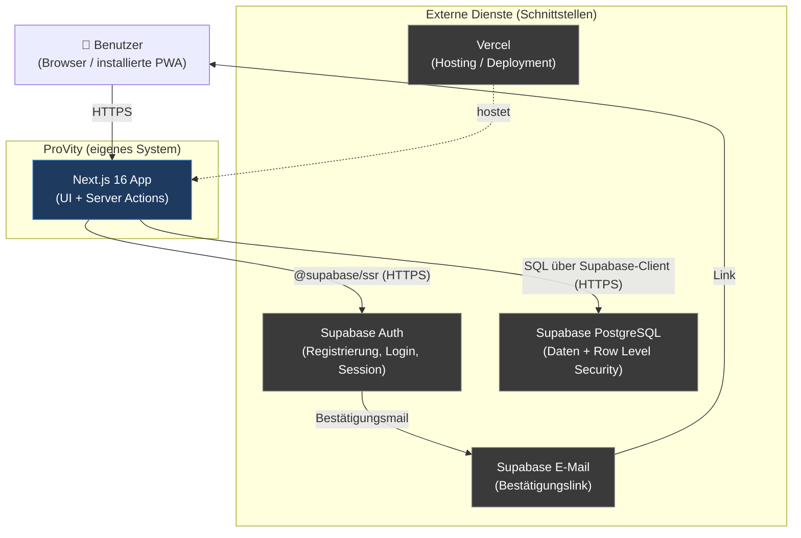
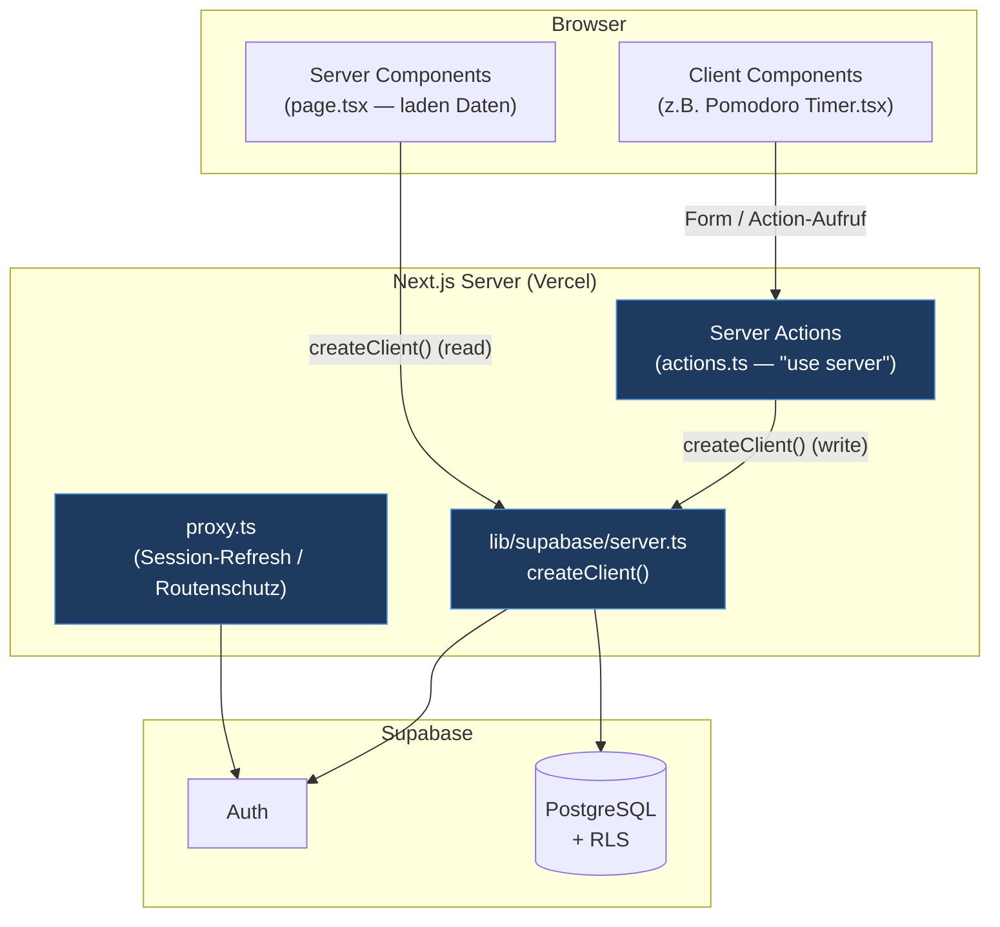
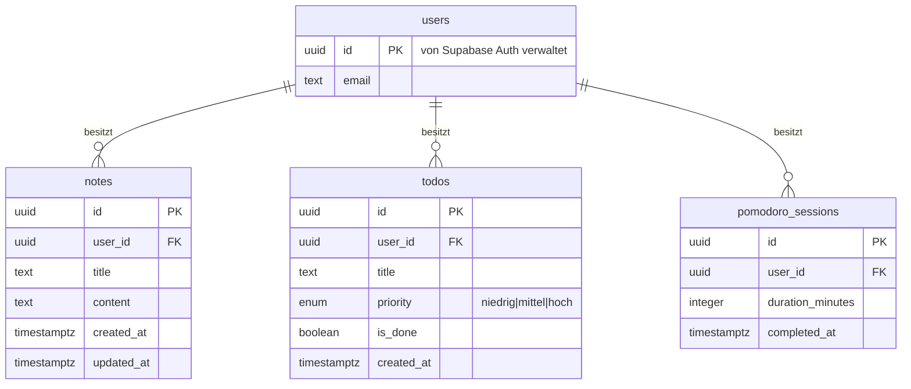
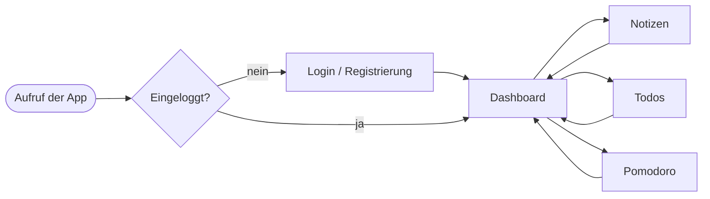

# Architektur & Diagramme — ProVity

> Deckt A-4 (Konzeptionelle Umsetzung), A-5 (Systemgrenzen/Schnittstellen)
> und B-9 (Grafiken/Diagramme) ab. Diagramme als Mermaid — auf GitHub direkt
> lesbar und für den Word-Bericht als PNG exportierbar (z.B. mermaid.live oder
> VS-Code-Extension "Markdown Preview Mermaid Support").

---

## 1. Systemkontext / Systemgrenzen (A-5)

Grenzt ab, was Teil von ProVity ist und was "aussen" liegt (externe Dienste,
mit denen über definierte Schnittstellen kommuniziert wird).

**Schnittstellen im Detail:**

| Schnittstelle | Richtung | Protokoll | Zweck |
|---------------|----------|-----------|-------|
| Browser ↔ Next.js | bidirektional | HTTPS | Auslieferung der UI, Server Actions |
| Next.js ↔ Supabase Auth | bidirektional | HTTPS (`@supabase/ssr`) | Registrierung, Login, Session-Cookies |
| Next.js ↔ Supabase DB | bidirektional | HTTPS / PostgREST | Lesen/Schreiben der Nutzerdaten, RLS-gefiltert |
| Supabase ↔ Benutzer | ausgehend | E-Mail | Bestätigungslink bei Registrierung |
| GitHub → Vercel | ausgehend | Webhook | Automatisches Deployment pro Push/PR |

**Bewusst ausserhalb der Systemgrenze (laut Projektantrag):** native Mobile-Apps,
Zusammenarbeit zwischen Benutzern, Kalender-Integration, Offline-Synchronisation.

---

## 2. Applikationsarchitektur (A-4)

Zeigt die Schichten der Next.js-App und das verbindliche Muster
(Server Components/Actions nutzen den Server-Client, Browser nie direkt
schreibend).

**Verbindliches Muster (siehe Issues #5–#8):**

- Lesen passiert in **Server Components** (`page.tsx`) via `createClient()` aus
  `@/lib/supabase/server`.
- Schreiben passiert ausschliesslich in **Server Actions** (`actions.ts`,
  `"use server"`) — nie als clientseitiger `fetch` gegen Supabase.
- Der **Browser-Client** (`lib/supabase/client.ts`) wird nur dort verwendet, wo
  echte Interaktivität im Browser nötig ist (z.B. Timer-Zustand).

---

## 3. Datenbankschema / ER-Diagramm (A-4, B-9)

Alle fachlichen Tabellen hängen an `auth.users` (von Supabase verwaltet) und
sind über `user_id` + RLS pro Nutzer isoliert.

**Datenisolation (RLS):** Jede Tabelle hat `row level security` aktiviert; die
Policies erlauben Zeilenzugriff nur, wenn `auth.uid() = user_id`. Dadurch sieht
jeder Nutzer ausschliesslich seine eigenen Daten — auch das Dashboard, das nur
lesend aus den drei Tabellen aggregiert, profitiert automatisch von diesen
Policies (RLS gilt für jede Query, nicht nur für das ursprüngliche Modul).

**Designentscheid `pomodoro_sessions`:** kein Update/Delete — abgeschlossene
Sessions sind unveränderliche Historie (begründet in `entscheidungen.md`).

---

## 4. Benutzerfluss (A-4)

<!-- Anleitung: Diagramme bei Schemaänderungen nachführen. Für den finalen
Word-Bericht als PNG exportieren und mit Bildunterschrift/Legende einfügen. -->
